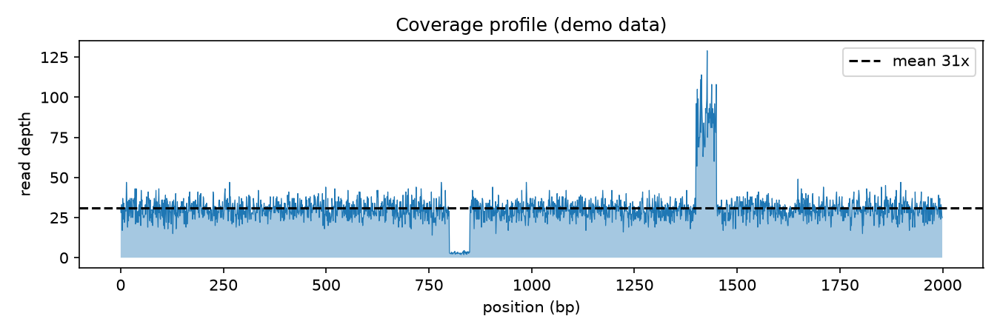

# Coverage Depth Profiler

Two regions can have identical average coverage and completely different reliability. The depth profile shows you the truth: where reads pile up, and where they vanish.

## Why This Matters

Uneven coverage quietly breaks variant calling. Drop-outs leave you no power to call anything; pile-ups — usually repeats or duplications — manufacture false positives. Looking at the profile *before* you call variants saves hours of chasing artefacts that were never real.

## How It Works

1. Count the reads covering each position in the region.
2. Plot depth across the region.
3. Mark the mean and eyeball the deviations.

## What the Demo Shows



The demo plants a drop-out and a repeat pile-up in a simulated region. The flat band sits at the mean depth, while the dip and the spike flag exactly the stretches you would treat with caution before trusting a variant call.

## Run It

```bash
pip install -r requirements.txt
python demo.py
```

> Demonstrated on synthetic data, so the whole thing is reproducible with no external downloads.
